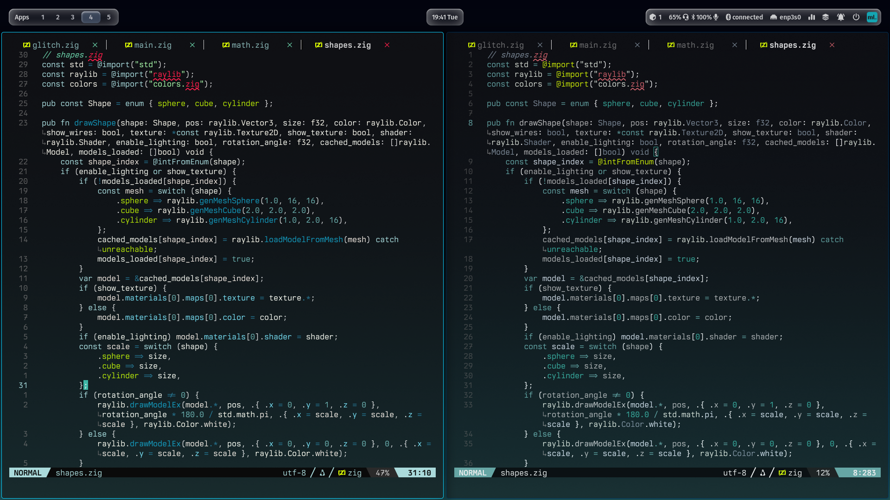

# Heap for Neovim

A clean, modern, and vibrant dark theme for Neovim



## Features

- **Two Variants**:
  - `heap`: The classic teal dark theme.
  - `heap-dark`: A premium sea green/black variant with deep contrast.
- **Vibrant Statusline**: Custom Lualine themes with high-visibility mode indicators.
- **Transparency Support**: Simple toggle for a fully transparent UI.
- **LSP Inlay Hints**: Native Neovim 0.10+ inlay hint support.
- **Modern Plugin Support**:
  - **Core**: Treesitter, LSP, Diagnostics
  - **Fuzzy Finders**: Telescope, fzf-lua
  - **File Explorers**: NvimTree, Neo-tree, Oil.nvim
  - **Completion**: Blink.cmp, nvim-cmp
  - **UI**: Lualine, Bufferline, Noice, nvim-notify, Snacks
  - **Git**: Gitsigns, Diffview
  - **Navigation**: Harpoon, Flash
  - **Markdown**: render-markdown.nvim
  - **Other**: Lazy, Mason, Which-key, Trouble, Mini.nvim

## Installation

### [lazy.nvim](https://github.com/folke/lazy.nvim)

```lua
{
  "valonmullolli/heap-nvim",
  priority = 1000,
  config = function()
    -- Optional: run setup before loading the colorscheme
    require('heap').setup({
      variant = "dark", -- "default" or "dark"
      transparent = false,
    })
    vim.cmd.colorscheme('heap-dark')
  end,
}
```

## Configuration

The `setup()` function is optional. All defaults are balanced for the best experience.

```lua
require('heap').setup({
  variant = "default",      -- "default" or "dark"
  transparent = false,      -- Enable transparency
  cursorline = true,        -- Toggle cursorline

  -- Fine-tune specific UI behaviors
  tweak_ui = {
    enable_end_of_buffer = true, -- Hide the '~' at the end of buffers
    disable_undercurl = false,   -- Toggle curly underlines
  },

  -- Enable/disable specific plugin integrations
  plugins = {
    telescope = true,
    lualine = true,
    -- ... most popular plugins are true by default
  }
})
```

## Lualine Integration

To use the matching vibrant Lualine theme:

```lua
require('lualine').setup({
  options = {
    theme = 'heap', -- This automatically adapts to your active variant
  }
})
```

## License

MIT License. See [LICENSE](./LICENSE) for details.

