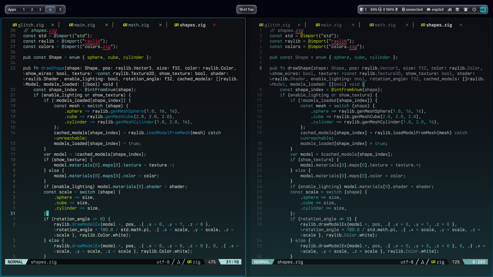

# Heap for Neovim

A clean, modern dark colorscheme for Neovim with two dark variants.



## Requirements

- Neovim `0.10.0+`

## Installation

### lazy.nvim

```lua
{
  "valonmulolli/heap.nvim",
  priority = 1000,
  config = function()
    require("heap").setup({
      variant = "default", -- "default" or "dark"
    })
    vim.cmd.colorscheme("heap")
  end,
}
```

### vim.pack

```lua
-- In your plugin list:
vim.pack.add({
  src = "https://github.com/valonmulolli/heap.nvim",
  name = "heap.nvim",
})

-- Then apply:
vim.cmd.colorscheme("heap")
```

### Manual (no plugin manager)

```bash
git clone https://github.com/valonmulolli/heap.nvim ~/.local/share/nvim/site/pack/plugins/start/heap.nvim
```

## Usage

```vim
:colorscheme heap
:colorscheme heap-dark
```

## Configuration

`setup()` is optional. If omitted, defaults are used.

```lua
require("heap").setup({
  variant = "default", -- "default" or "dark"
  transparent = false,
  cursorline = true,

  -- Auto-detect integrations from lazy.nvim / vim.pack / mini.deps
  auto = true,
  -- Cache detected plugin set to stdpath("cache")
  cache = true,

  -- Backward-compatible transparency flag
  transparent_background = false,

  tweak_ui = {
    enable_end_of_buffer = true,
    disable_undercurl = false,
  },

  tweak_background = {}, -- ex: { normal = "none", menu = "#111111" }
  tweak_syntax = {},     -- ex: { keyword = "#ff0000" }
  tweak_highlight = {},  -- direct `vim.api.nvim_set_hl`-style overrides

  plugins = {
    telescope = true,
    which_key = true,
    dashboard = true,
    indent_blankline = true,
    neo_tree = true,
    trouble = true,
    noice = true,
    mini = true,
    flash = true,
    blink = true,
    gitsigns = true,
    lazy = true,
    mason = true,
    snacks = true,
    notify = true,
    render_markdown = true,
    fzf_lua = true,
    oil = true,
    harpoon = true,
    nvim_tree = true,
    bufferline = true,
  },
})
```

If you want manual plugin toggles only, set `auto = false`.

## Commands

- `:Heap` loads the theme.
- `:HeapFetch` clears Heap cache and reloads the colorscheme.

## Lualine

```lua
require("lualine").setup({
  options = {
    theme = "heap", -- use "heap-dark" for :colorscheme heap-dark
  },
})
```

## Extras

The `extras/` folder includes:

- `extras/fzf/`
- `extras/ghostty/`
- `extras/kitty/`
- `extras/lazygit/`
- `extras/yazi/`

Each has `heap` and `heap-dark` variants.

## Project Structure

```text
.
├── colors/
├── extras/
├── lua/
│   ├── heap.lua
│   └── heap/
│       ├── config.lua
│       ├── groups/
│       ├── init.lua
│       ├── palette/
│       ├── types/
│       └── utils.lua
├── tests/
├── .github/workflows/
│   ├── release.yml
│   └── test.yml
├── CHANGELOG.md
└── doc/heap.txt
```

## CI and Release

- `test.yml`: runs the test suite on pushes and pull requests.
- `release.yml`: runs release-please on `main`.
- `CHANGELOG.md`: maintained for releases.

## License

MIT License - see [LICENSE](./LICENSE).
